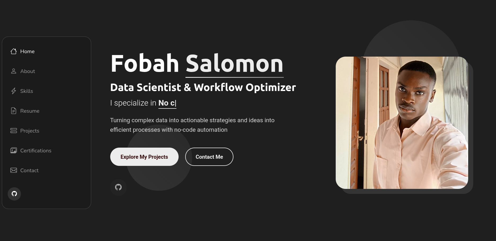

# 📁 Portfolio – Fobah N’gouan Salomon

Bienvenue dans le dépôt de mon portfolio personnel.  
Ce site présente mon parcours, mes compétences, mes projets et mes réalisations.  
Il est hébergé directement via **GitHub Pages**.

🔗 **Version en ligne :** https://fobahsalomon.github.io/portfolio

---

## 🚀 Aperçu

  


---

## 🧩 Fonctionnalités

- Présentation personnelle
- Liste de projets avec liens
- Compétences techniques
- Contact et réseaux sociaux
- Interface responsive
- Design simple et professionnel

---

## 🛠️ Technologies utilisées

- **HTML5**  
- **CSS3**  
- **JavaScript**  
- **GitHub Pages** pour l’hébergement  
-

---

## 📂 Structure du projet

```bash
/
├── projets/
├── index.html
├── assets/
│   ├── css/
│   ├── js/
│   └── images/
└── README.md

```

## 🔧 Installation locale

Pour lancer le site en local :
```bash
git clone https://github.com/fobahsalomon/portfolio.git
cd portfolio
```
Ouvre ensuite index.html dans ton navigateur.

## 🌐 Déploiement

Le portfolio est automatiquement déployé via GitHub Pages :

Pousser les modifications sur la branche main.

GitHub Pages reconstruit automatiquement la version en ligne.


## 📬 Contact

Email : fobahngouansalomon@gmail.com

GitHub : https://github.com/fobahsalomon

Localisation : Abidjan, Côte d’Ivoire

## 📌 Licence

Ce portfolio est disponible sous licence MIT.
Vous êtes libre de l’utiliser comme modèle ou inspiration.